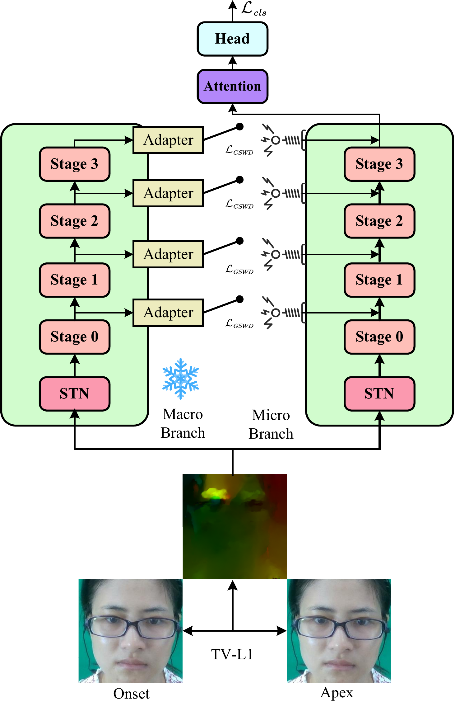
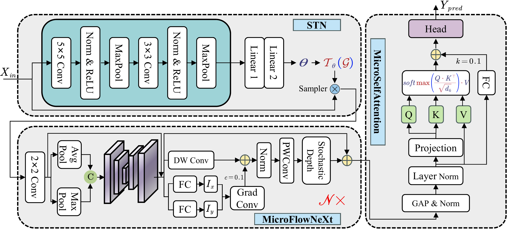

# DAD-Net: Distribution-Aligned Dual-Stream Framework for Cross-Domain Micro-Expression Recognition

<p align="center">
  <a href="#english">English</a> | <a href="#中文">中文</a>
</p>

---

<a name="english"></a>
## English

### Overview

DAD-Net is a dual-branch deep learning framework for micro-expression recognition that synergizes cross-domain knowledge transfer from macro-expressions with motion-aware learning. The framework addresses two critical challenges in micro-expression recognition: subtle motion patterns obscured by appearance variations and severe data scarcity.

### Key Features

- **Dual-Stream Architecture**: Frozen macro-expression teacher branch + trainable micro-expression student branch
- **MicroFlowNeXt Backbone**: Motion-sensitive architecture with Spatial Transformer Network (STN), Gradient-Aware Blocks, and Peak-Enhanced Channel Attention
- **GSWD Alignment**: Multi-level Gaussian Sliced-Wasserstein Distance for feature distribution alignment
- **Flow Vector Correction**: Geometric correction for optical flow vectors after spatial transformation

### Architecture

#### DAD-Net Framework

<p align="center">
  
</p>

#### MicroFlowNeXt Backbone

<p align="center">
  
</p>

### Installation

#### Method 1: Install as Python Package (Recommended)

```bash
# Clone the repository
git clone https://github.com/your-repo/DAD-Net.git
cd DAD-Net

# Install as editable package
pip install -e .

# Or install with all dependencies
pip install -e ".[full]"
```

#### Method 2: Direct Usage

```bash
# Clone the repository
git clone https://github.com/your-repo/DAD-Net.git
cd DAD-Net

# Install core dependencies
pip install torch torchvision numpy tqdm

# Install optional dependencies for training
pip install pandas scikit-learn opencv-python opencv-contrib-python
pip install matplotlib seaborn adabelief-pytorch
```

#### Verify Installation

```python
# Test basic import
import dad_net
model = dad_net.get_microflownext(num_classes=3)
print(f"DAD-Net version: {dad_net.__version__}")
```

### Pre-trained Weights

We provide pre-trained weights for the macro-expression branch, which is frozen during micro-expression training.

| Model | Description | Download |
|-------|-------------|----------|
| Macro Branch | MicroFlowNeXt trained on macro-expression data | [macro_expression_weights.pth](pretrained_weights/macro_expression_weights.pth) |

**Usage:**

```python
from models import get_dad_net

# Load DAD-Net with pre-trained macro weights
model = get_dad_net(
    num_classes=3,
    macro_weights_path='pretrained_weights/macro_expression_weights.pth',
    alignment_weight=0.5,
)
```

### Project Structure

```
DAD-Net/
├── models/
│   ├── __init__.py
│   ├── microflownext.py        # MicroFlowNeXt backbone
│   └── dad_net.py              # Dual-stream DAD-Net
├── losses/
│   ├── __init__.py
│   └── gswd.py                 # GSWD loss function
├── data/
│   ├── __init__.py
│   ├── dataset.py              # Dataset classes
│   ├── preprocessing.py        # Optical flow preprocessing
│   └── augmentation.py         # Flow-consistent augmentation
├── utils/
│   ├── __init__.py
│   ├── metrics.py              # Evaluation metrics
│   └── training.py             # Training utilities
├── configs/
│   ├── __init__.py
│   └── default.py              # Default configurations
├── pretrained_weights/
│   └── macro_expression_weights.pth  # Pre-trained macro branch
├── figures/
│   ├── dad_net_architecture.png
│   └── microflownext_architecture.png
├── train.py                    # Training script
├── inference.py                # Inference script
└── README.md
```

### Usage

#### Training

```bash
# Train DAD-Net on 4DME dataset with LOSO cross-validation
python train.py \
    --dataset 4dme \
    --data_dir /path/to/4dme/optical_flow \
    --output_dir ./results/4dme \
    --model_type dad_net \
    --macro_weights pretrained_weights/macro_expression_weights.pth \
    --alignment_weight 0.5 \
    --alignment_stages 2,3

# Train baseline model (single-stream)
python train.py \
    --dataset 4dme \
    --data_dir /path/to/4dme/optical_flow \
    --output_dir ./results/4dme_baseline \
    --model_type baseline
```

#### Inference

```bash
# Single sample inference
python inference.py \
    --checkpoint ./results/best_model.pth \
    --input ./sample.npy \
    --model_type dad_net \
    --show_probs
```

#### Python API

```python
from models import get_dad_net, get_microflownext
from data import MicroExpressionDataset, OpticalFlowAugmentation

# Create DAD-Net model
model = get_dad_net(
    num_classes=3,
    micro_model_size='micro',
    macro_model_size='ultralight',
    alignment_stages={0: False, 1: False, 2: True, 3: True},
    macro_weights_path='pretrained_weights/macro_expression_weights.pth',
    alignment_weight=0.5,
)

# Create baseline model
baseline = get_microflownext(num_classes=3, model_size='micro')

# Create dataset with augmentation
transform = OpticalFlowAugmentation(
    horizontal_flip_prob=0.5,
    rotation_range=10.0,
    scale_range=(0.9, 1.1),
)
dataset = MicroExpressionDataset(file_paths, transform=transform)
```

### Supported Datasets

| Dataset | Classes | Samples | Evaluation Protocol |
|---------|---------|---------|---------------------|
| 4DME    | 3       | 690     | LOSO                |
| CASME III | 3     | 1,109   | LOSO                |
| DFME    | 3       | 7,526   | Official Split      |
| CASME II | 3      | 247     | LOSO                |

### Hyperparameters

| Parameter | 4DME/CASME III | DFME |
|-----------|----------------|------|
| λ (alignment weight) | 0.5 | 0.1 |
| L (GSWD projections) | 100 | 100 |
| Batch size | 8 | 8 |
| Learning rate | 1e-4 | 1e-4 |
| Epochs | 205 | 205 |
| Label smoothing | 0.05 | 0.05 |

### Citation

This paper is currently under review at *IEEE Transactions on Image Processing*. The citation information will be updated upon acceptance.

---

<a name="中文"></a>
## 中文

### 概述

DAD-Net是一个用于微表情识别的双分支深度学习框架,通过协同宏表情的跨域知识迁移与运动感知学习来实现。该框架解决了微表情识别中的两个关键挑战:被外观变化和噪声掩盖的细微运动模式,以及严重的数据稀缺问题。

### 主要特性

- **双流架构**: 冻结的宏表情教师分支 + 可训练的微表情学生分支
- **MicroFlowNeXt主干网络**: 运动敏感架构,包含空间变换网络(STN)、梯度感知模块和峰值增强通道注意力
- **GSWD对齐**: 多层级高斯切片Wasserstein距离用于特征分布对齐
- **光流向量校正**: 空间变换后对光流向量进行几何校正,确保物理一致性

### 架构

#### DAD-Net框架

<p align="center">
  
</p>

#### MicroFlowNeXt主干网络

<p align="center">
  
</p>

### 安装

#### 方法1: 作为Python包安装 (推荐)

```bash
# 克隆仓库
git clone https://github.com/your-repo/DAD-Net.git
cd DAD-Net

# 以可编辑模式安装
pip install -e .

# 或安装全部依赖
pip install -e ".[full]"
```

#### 方法2: 直接使用

```bash
# 克隆仓库
git clone https://github.com/your-repo/DAD-Net.git
cd DAD-Net

# 安装核心依赖
pip install torch torchvision numpy tqdm

# 安装训练所需的可选依赖
pip install pandas scikit-learn opencv-python opencv-contrib-python
pip install matplotlib seaborn adabelief-pytorch
```

#### 验证安装

```python
# 测试导入
import dad_net
model = dad_net.get_microflownext(num_classes=3)
print(f"DAD-Net 版本: {dad_net.__version__}")
```

### 预训练权重

我们提供宏表情分支的预训练权重,该分支在微表情训练期间保持冻结。

| 模型 | 描述 | 下载 |
|------|------|------|
| 宏表情分支 | 在宏表情数据上训练的MicroFlowNeXt | [macro_expression_weights.pth](pretrained_weights/macro_expression_weights.pth) |

**使用方法:**

```python
from models import get_dad_net

# 加载带有预训练宏表情权重的DAD-Net
model = get_dad_net(
    num_classes=3,
    macro_weights_path='pretrained_weights/macro_expression_weights.pth',
    alignment_weight=0.5,
)
```

### 项目结构

```
DAD-Net/
├── models/
│   ├── __init__.py
│   ├── microflownext.py        # MicroFlowNeXt主干网络
│   └── dad_net.py              # 双流DAD-Net模型
├── losses/
│   ├── __init__.py
│   └── gswd.py                 # GSWD损失函数
├── data/
│   ├── __init__.py
│   ├── dataset.py              # 数据集类
│   ├── preprocessing.py        # 光流预处理
│   └── augmentation.py         # 光流一致性数据增强
├── utils/
│   ├── __init__.py
│   ├── metrics.py              # 评估指标
│   └── training.py             # 训练工具
├── configs/
│   ├── __init__.py
│   └── default.py              # 默认配置
├── pretrained_weights/
│   └── macro_expression_weights.pth  # 预训练宏表情权重
├── figures/
│   ├── dad_net_architecture.png
│   └── microflownext_architecture.png
├── train.py                    # 训练脚本
├── inference.py                # 推理脚本
└── README.md
```

### 使用方法

#### 训练

```bash
# 在4DME数据集上使用LOSO交叉验证训练DAD-Net
python train.py \
    --dataset 4dme \
    --data_dir /path/to/4dme/optical_flow \
    --output_dir ./results/4dme \
    --model_type dad_net \
    --macro_weights pretrained_weights/macro_expression_weights.pth \
    --alignment_weight 0.5 \
    --alignment_stages 2,3

# 训练基线模型(单流)
python train.py \
    --dataset 4dme \
    --data_dir /path/to/4dme/optical_flow \
    --output_dir ./results/4dme_baseline \
    --model_type baseline
```

#### 推理

```bash
# 单样本推理
python inference.py \
    --checkpoint ./results/best_model.pth \
    --input ./sample.npy \
    --model_type dad_net \
    --show_probs
```

#### Python API

```python
from models import get_dad_net, get_microflownext
from data import MicroExpressionDataset, OpticalFlowAugmentation

# 创建DAD-Net模型
model = get_dad_net(
    num_classes=3,
    micro_model_size='micro',
    macro_model_size='ultralight',
    alignment_stages={0: False, 1: False, 2: True, 3: True},
    macro_weights_path='pretrained_weights/macro_expression_weights.pth',
    alignment_weight=0.5,
)

# 创建基线模型
baseline = get_microflownext(num_classes=3, model_size='micro')

# 创建带数据增强的数据集
transform = OpticalFlowAugmentation(
    horizontal_flip_prob=0.5,
    rotation_range=10.0,
    scale_range=(0.9, 1.1),
)
dataset = MicroExpressionDataset(file_paths, transform=transform)
```

### 支持的数据集

| 数据集 | 类别数 | 样本数 | 评估协议 |
|--------|--------|--------|----------|
| 4DME   | 3      | 690    | LOSO     |
| CASME III | 3   | 1,109  | LOSO     |
| DFME   | 3      | 7,526  | 官方划分 |
| CASME II | 3    | 247    | LOSO     |

### 超参数设置

| 参数 | 4DME/CASME III | DFME |
|------|----------------|------|
| λ (对齐权重) | 0.5 | 0.1 |
| L (GSWD投影数) | 100 | 100 |
| 批量大小 | 8 | 8 |
| 学习率 | 1e-4 | 1e-4 |
| 训练轮次 | 205 | 205 |
| 标签平滑 | 0.05 | 0.05 |

### 引用

本文目前正在 *IEEE Transactions on Image Processing* 审稿中,引用信息将在论文被接收后更新。

---

## License

This project is released under the MIT License.

## Acknowledgements

This work was supported by Shandong University. We thank the creators of the 4DME, CASME III, DFME, and CASME II datasets for making their data available for research.
