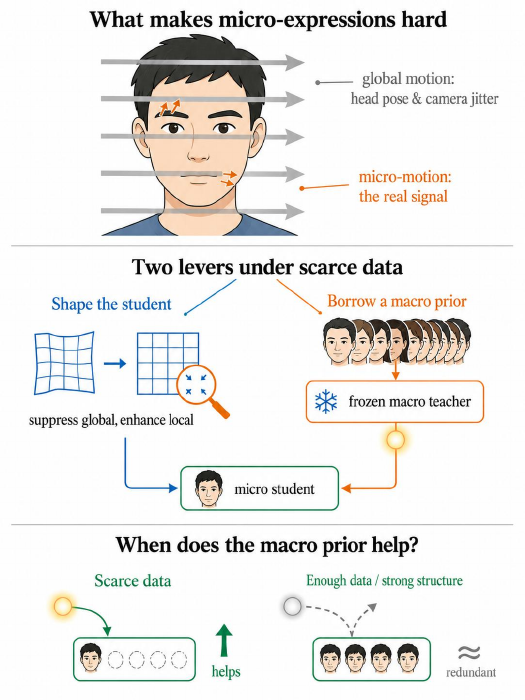
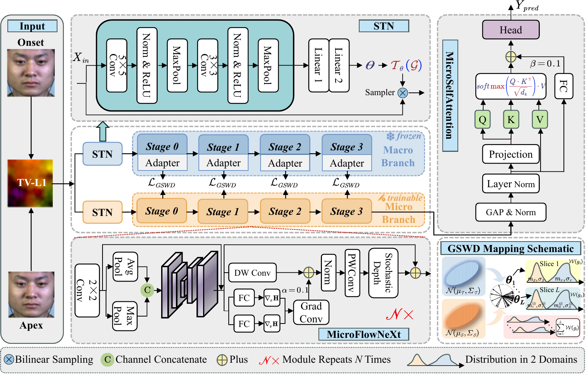
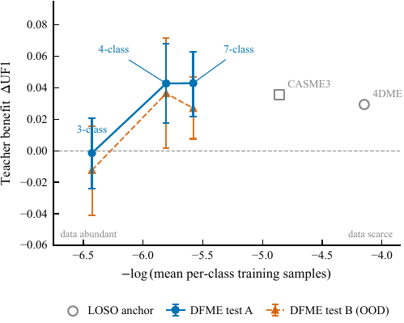
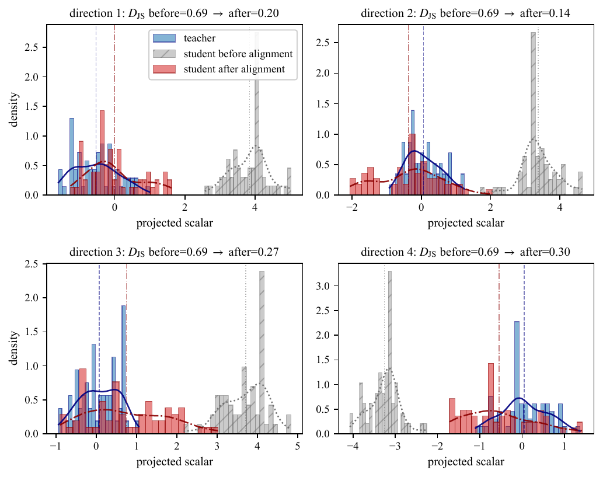
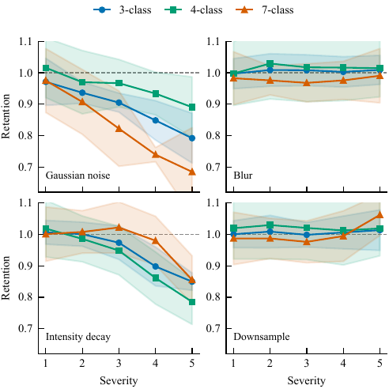

<h1 align="center">DAD-Net</h1>
<p align="center">
  <b>A Distribution-Aligned Dual-Stream Network for Macro-Guided Micro-Expression Recognition</b>
</p>

<p align="center">
  
  
  
</p>

DAD-Net pairs a **frozen macro-expression teacher** with a **trainable
micro-expression student** and aligns their intermediate feature
distributions at several backbone stages with the **Gaussian Sliced-Wasserstein
Distance (GSWD)** — a closed-form, correspondence-free objective. The student
backbone, **MicroFlowNeXt**, is organized around a motion dichotomy: it
suppresses nuisance global motion and preserves weak local motion. Beyond strong
recognition accuracy, the framework characterizes a **capacity-dependent
boundary**: a macro prior helps when the student is under-determined and becomes
redundant once a capacity-matched student suffices.

<p align="center">
  
</p>

> Micro-expression recognition must recover weak, local facial motion hidden
> under nuisance global motion such as head pose and camera jitter **(a)**. Under
> scarce data two levers help: a student that suppresses global and enhances
> local motion, and a prior borrowed from abundant macro data **(b)**. The macro
> prior helps mainly when the student is under-determined and becomes redundant
> once data or structure suffice — the capacity-substitution pattern we study
> **(c)**.

---

## Highlights

- **Dual-stream alignment.** A frozen macro teacher regularizes the student
  through multi-level GSWD, matching projected Gaussian moments without any
  pointwise teacher-student correspondence.
- **Motion-sensitive backbone.** MicroFlowNeXt couples flow-consistent spatial
  normalization (global-motion suppression) with gradient-aware enhancement,
  peak-preserving channel attention, and restrained self-attention
  (local-motion preservation).
- **A capacity-substitution boundary.** Distillation and structural capacity act
  as substitutable routes to a comparable representation, yielding an
  operational criterion for when a macro prior is worth using.
- **One configurable family.** A single model family is evaluated across 4DME,
  CASME3, and DFME, spanning three- to seven-class settings.

## Framework

<p align="center">
  
</p>

Given the onset and apex frames of a clip, a dense TV-L1 optical-flow field is
fed to both streams. The teacher is frozen and supplies reference feature
distributions; the student is trained with a label-smoothed cross-entropy loss
plus a GSWD alignment term averaged over the active stages:

```
L_total = L_cls + lambda * (1 / |A|) * sum_{s in A} L_GSWD(s)
```

Lightweight 1x1 convolution + batch-norm adapters bridge teacher and student
channel widths when they differ. `lambda = 0` switches the teacher off, reducing
DAD-Net to a single-stream student.

### MicroFlowNeXt components

| Component | Role |
|---|---|
| Flow-consistent spatial transformer | Normalizes the flow field and reorients sampled vectors by the inverse affine linear part (suppresses global motion) |
| Gradient-aware block | Fuses a depthwise main branch with a channel-wise central-difference gradient branch (enhances weak local motion) |
| Peak-enhanced channel attention | Combines average and max pooling so sparse but discriminative responses survive downsampling |
| MicroSelfAttention | Shared query/key token attention with an additive enhancement branch (student head only) |

## The capacity-substitution boundary

<p align="center">
  
</p>

The teacher benefit (UF1 of the dual model minus UF1 of the single-stream
student) grows toward the data-scarce end and vanishes at the data-rich
three-class DFME setting. This is the empirical core of the paper: when the
student structure cannot yet fit the data, the macro prior supplies the missing
capacity; once the student is sufficient, the prior becomes redundant.

## Analysis

<p align="center">
  
  
</p>

**Left:** after distillation, the student marginals along random GSWD projection
directions move toward the teacher density. **Right:** the selected student keeps
most of its accuracy under inference-time corruptions of the flow field; blur and
downsampling barely degrade because optical flow is low-frequency, while additive
noise and intensity decay degrade gracefully.

## Installation

```bash
git clone https://github.com/LanEinstein/DAD-Net.git
cd DAD-Net

# Core package (model + training)
pip install -e .

# Optional preprocessing stack (dlib + OpenCV TV-L1)
pip install -e ".[preprocess]"
```

```python
import torch
import dadnet

model = dadnet.get_microflownext(num_classes=3)
print(dadnet.__version__)
print(model(torch.randn(1, 2, 224, 224))[1].shape)  # torch.Size([1, 3])
```

## Data preparation

Inputs are pre-computed two-channel TV-L1 optical-flow fields, one per clip,
stored as NumPy arrays of shape `(2, H, W)` or `(H, W, 2)`.

1. **Extract optical flow** from the onset and apex frames with the
   preprocessing utilities (dlib face alignment + TV-L1 flow):

   ```python
   import dlib, numpy as np
   from dadnet.data.preprocessing import process_clip

   detector = dlib.get_frontal_face_detector()
   predictor = dlib.shape_predictor("shape_predictor_68_face_landmarks.dat")
   flow = process_clip("onset.png", "apex.png", detector, predictor)  # (H, W, 2)
   np.save("clip_0001.npy", flow)
   ```

   The dlib landmark model `shape_predictor_68_face_landmarks.dat` is a
   third-party file available from the
   [dlib model repository](http://dlib.net/files/shape_predictor_68_face_landmarks.dat.bz2).

2. **Write an index CSV** with one row per clip and the columns
   `flow_path,label,subject`:

   ```csv
   flow_path,label,subject
   /data/4dme/clip_0001.npy,0,sub01
   /data/4dme/clip_0002.npy,2,sub01
   /data/4dme/clip_0003.npy,1,sub02
   ```

   `label` is an integer class index; `subject` drives the LOSO folds and the
   subject-disjoint internal-validation split. For DFME, prepare one index per
   partition (`train`, `testA`, `testB`).

> Datasets (4DME, CASME3, DFME, CK+) must be obtained from their original
> providers under their respective licenses. This repository ships no data and
> no trained weights.

## Usage

DAD-Net distills from a macro teacher, so first train a teacher, then train the
student. When `lambda = 0` (DFME three- and four-class) the teacher term is off
and the teacher checkpoint is optional.

#### 1. Pretrain the macro teacher (CK+)

```bash
python scripts/train_macro_teacher.py \
    --index data/ckplus/index_3class.csv \
    --model-size base \
    --output weights/teacher_base.pth
```

#### 2. Train the student under LOSO (4DME / CASME3)

```bash
python scripts/train_loso.py \
    --benchmark 4dme \
    --index data/4dme/index_3class.csv \
    --macro-weights weights/teacher_base.pth \
    --output outputs/4dme_loso.json
```

#### 3. Train the student on the DFME official split (5 seeds)

```bash
python scripts/train_dfme.py \
    --benchmark dfme_3class \
    --train-index data/dfme/train_3class.csv \
    --testa-index data/dfme/testA_3class.csv \
    --testb-index data/dfme/testB_3class.csv \
    --output outputs/dfme_3class.json \
    --save-student weights/dfme_3class_student.pth
```

#### 4. Evaluate out-of-distribution robustness (DFME test B)

```bash
python scripts/evaluate_robustness.py \
    --benchmark dfme_3class \
    --checkpoint weights/dfme_3class_student.pth \
    --testb-index data/dfme/testB_3class.csv \
    --output outputs/robustness_3class.json
```

#### 5. Compare alignment objectives (GSWD vs. baselines)

```bash
python scripts/ablation_alignment.py \
    --benchmark dfme_7class \
    --train-index data/dfme/train_7class.csv \
    --testa-index data/dfme/testA_7class.csv \
    --testb-index data/dfme/testB_7class.csv \
    --macro-weights weights/teacher_micro.pth \
    --output outputs/alignment_ablation.json
```

#### 6. Single-clip inference

```bash
python scripts/inference.py \
    --benchmark dfme_3class \
    --checkpoint weights/dfme_3class_student.pth \
    --input sample_flow.npy
```

### Python API

```python
from dadnet import build_dadnet, get_benchmark
from dadnet.engine import fit_trajectory, set_seed
from dadnet.data import read_index, build_loso_folds

set_seed(42)
config = get_benchmark("casme3")          # base student, TFFT, lambda=1.0, h-flip
model = build_dadnet(config, macro_weights_path="weights/teacher_base.pth")
```

## Per-benchmark configuration

The single DAD-Net family is configured by three design variables — student
width, the four-stage alignment mask, and `lambda` — selected on internal
validation for DFME and fixed per dataset for the LOSO benchmarks.

| Benchmark | Student width | Stage mask | lambda | Augmentation | Pruned modules |
|---|---|---|---|---|---|
| 4DME (3-class, LOSO) | `[128,256,512,1024]` | `TFTT` | 1.5 | standard | — |
| CASME3 (3-class, LOSO) | `[128,256,512,1024]` | `TFFT` | 1.0 | h-flip | — |
| DFME (3-class) | `[96,192,384,768]` | `FFTT` | 0.0 | standard | channel attn., head attn. |
| DFME (4-class) | `[128,256,512,1024]` | `FFTT` | 0.0 | standard | channel attn., head attn. |
| DFME (7-class) | `[48,96,192,384]` | `FFTT` | 1.0 | standard | STN, channel attn., head attn. |

The stage mask marks the four backbone stages with alignment active (`T`) or
inactive (`F`). These are encoded in [`dadnet/configs/default.py`](dadnet/configs/default.py).

## Training recipe

| Setting | Value |
|---|---|
| Optimizer | AdamW |
| Learning rate | 3e-5 |
| Weight decay | 1e-4 |
| Batch size | 32 |
| Epochs | 100 |
| Early-stopping patience | 30 |
| LR schedule | Cosine annealing to 1e-7 |
| Label smoothing | 0.05 |
| GSWD projections (L) | 100 |
| Gradient fusion weight (alpha) | 0.1 |
| Enhancement weight (beta) | 0.1 |
| Selection | Internal-validation UF1 (DFME); fixed-schedule single run (LOSO) |
| Seeds | DFME: 5 seeds, mean ± std; LOSO: single representative run |

## Evaluation protocol

- **4DME / CASME3** follow the MEGC leave-one-subject-out protocol. Each subject
  is the test fold once, and UF1/UAR are pooled across folds.
- **DFME** uses the official train / test A / test B split. All hyper-parameters
  are selected on a 20% subject-disjoint validation partition carved from the
  official training set; test A and test B are evaluated once. Test B probes
  out-of-distribution generalization. The protocol, the exact subject-disjoint
  validation carves, and an audit that verifies no leakage are documented in
  [`no_leak_protocol/`](no_leak_protocol/).
- **Metrics.** UF1 (unweighted F1) and UAR (unweighted average recall), the
  standard metrics for the class imbalance of micro-expression recognition.

## Repository structure

```
dadnet/
├── models/
│   ├── microflownext.py   # backbone: STN, gradient block, channel attention, self-attention
│   └── dad_net.py         # dual-stream model, adapters, alignment aggregation
├── losses/
│   ├── gswd.py            # Gaussian Sliced-Wasserstein Distance
│   └── kd_baselines.py    # FitNet / L2 / MMD / KL / PKT / CRD
├── data/
│   ├── dataset.py         # optical-flow dataset + subject-aware splits
│   ├── augmentation.py    # flow-consistent augmentation (none / hflip / standard)
│   ├── preprocessing.py   # dlib face alignment + TV-L1 optical flow
│   └── perturbations.py   # inference-time robustness corruptions
├── engine/
│   ├── trainer.py         # shared train / evaluate / fit loop
│   ├── metrics.py         # UF1 / UAR / pooled metrics
│   └── utils.py           # seeding, parameter counting
├── configs/default.py     # per-benchmark configs and training recipe
└── builder.py             # build a model from a benchmark config
scripts/
├── train_macro_teacher.py # pretrain the CK+ teacher
├── train_loso.py          # 4DME / CASME3 LOSO
├── train_dfme.py          # DFME official split, multi-seed
├── evaluate_robustness.py # DFME test-B corruption retention
├── ablation_alignment.py  # GSWD vs. distillation baselines
└── inference.py           # single-clip prediction
no_leak_protocol/          # leakage-free DFME selection protocol
├── protocol.md            # specification of the no-leak protocol
├── splits/                # subject-disjoint internal-validation carves
├── monitor.py             # selection-source guard
└── verify_no_leak.py      # leakage audit over the splits
tests/test_smoke.py        # forward / loss / config checks
```

## Citation

A citation will be added once the corresponding paper is published. In the
meantime, please cite this repository:

```bibtex
@misc{dadnet,
  title  = {DAD-Net: A Distribution-Aligned Dual-Stream Network for
            Macro-Guided Micro-Expression Recognition},
  author = {Zhang, Lan},
  year   = {2026},
  howpublished = {\url{https://github.com/LanEinstein/DAD-Net}}
}
```

## License

Released under the [MIT License](LICENSE). The 4DME, CASME3, DFME, and CK+
datasets remain under their original licenses and must be obtained from their
providers.

## Acknowledgements

We thank the creators of the 4DME, CASME3, DFME, and CK+ datasets, and the
authors of dlib, TV-L1 optical flow, and the open-source tools this project
builds upon. The author also thanks his wife for providing the computational
resources that made this work possible.
